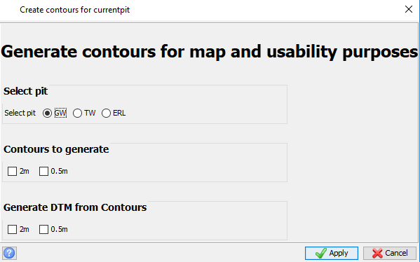

<!-- Notes -->

<!--
Include screenshots for editing alias and translation files within Surpac for ease of use for new users.

-->

# Alby Surpac

## About
In brief, this is a repo for alby's surpac files. It contains items from styles and profiles through to drawing files and macros.
- Includes macros, styles, profiles and templates to be used within Surpac
- Up to date files for use with latest versions of Surpac
>**Note:** Majority of macros are designed for with absolute references for logicals and files

## Important Info
- Surpac default files should only be changed as an advanced user

## Macros
Macros can be used as a tool to perform multiple tasks whether they be simple or intricate.
One of the major advantages of a macro, is allowing the user to input variables (different files and values) that can then be processed through various stages to give user defined outputs.

For example:
Processing a blasted stock volume
- create boundary to outersect existing boundaries (to avoid double payments)
- generate solid and clip with designs
- generate a custom volume and hole report for easy transposing into spreadsheets
- update blast boundary strings for record keeping and production assistance

### currentpit_contours
Launching the currentpit_contours macro opens the following GUI in Surpac
[]
As you can see, the macro allows you to select a "pit", this step essentially sets the working directory to that of the pit.
The macro then has options to decide the contour intervals to generate (that of which can be changed within the macro.tcl to suit requirements).
Also allowing the generation of a DTM (Digital Terrain Model) for enhanced visuals.

### Drone to DTM
Launching the drone to dtm macro opens the following GUI in Surpac
<!-- Insert screenshot of GUI -->
This macro is ready to use within any environment as it has no absolute references.
The general tasks of the macro include:
- user options to import "point cloud", "dtm" or "dxf mesh" files
- user defined export name and location
- 
